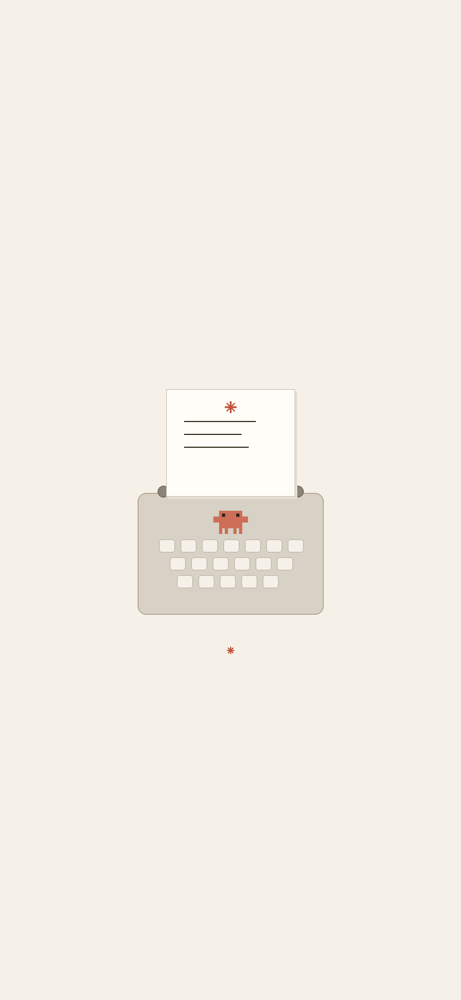

# Claude Typewriter ✳

> *Words Worth Keeping* — A typewriter-themed notes app for collecting inspiring quotes from Claude.

  

## ✨ Features

- **Typewriter typing animation** on every note
- **Search** with keyword highlighting
- **Multi-tag system** with `#` autocomplete
- **Pin / Edit / Copy / Share / Delete** notes
- **Share card** — beautiful typewriter illustration with typing animation, save as high-res PNG
- **Inspiration** — random Claude-style philosophical quotes
- **Clawd pixel mascot** — 7 animated scenes (happy bounce, rainy day, shy, typing, sleepy, autumn leaves, wave hello)
- **Typewriter sound effects** — keystroke, carriage return, paper feed
- **Haptic feedback** — graduated vibration for different actions
- **Data persistence** — notes saved in localStorage
- **iOS safe area** support
- **LXGW WenKai Mono** font for beautiful Chinese rendering

## 🚀 Live Demo

Visit: **[https://yourusername.github.io/claude-typewriter/](https://yourusername.github.io/claude-typewriter/)**

## 📦 Deploy to GitHub Pages

1. Fork this repo
2. Go to **Settings → Pages**
3. Under **Source**, select `main` branch and `/ (root)` folder
4. Click **Save**
5. Your site will be live at `https://yourusername.github.io/claude-typewriter/`

## 📱 iOS App

See the `ios/` branch or download from [Releases](../../releases) for the Capacitor-wrapped iOS version.

## 🎨 Design

| Element | Color |
|---------|-------|
| Background | `#F5F0E8` warm paper |
| Ink | `#2C2416` deep brown |
| Accent | `#C4553A` Anthropic orange-red |
| Clawd | `#CD6E58` coral crab |
| Paper | `#FFFDF7` off-white |

## 🛠 Tech Stack

- **React 18** (loaded from CDN, no build step required)
- **Babel Standalone** (JSX transpilation in browser)
- **Web Audio API** (typewriter sound effects)
- **Canvas API** (Clawd pixel animation + share card)
- **LXGW WenKai Mono TC** (Google Fonts, Chinese support)
- **Special Elite** / **Courier Prime** (typewriter English fonts)

## 📄 License

MIT — Made with ✳ and Claude.
